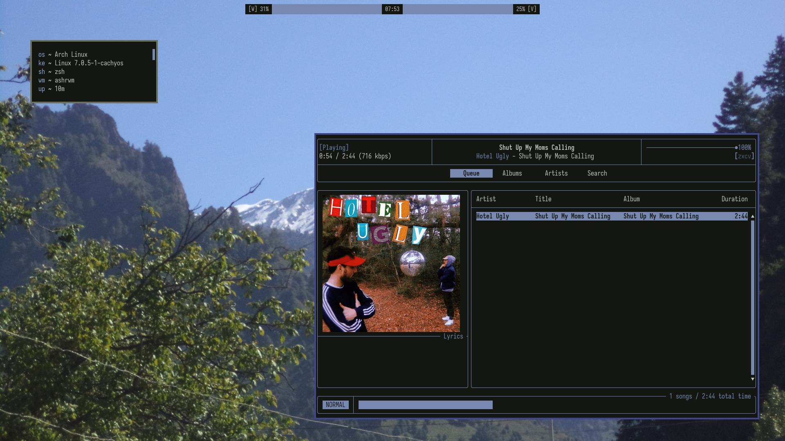
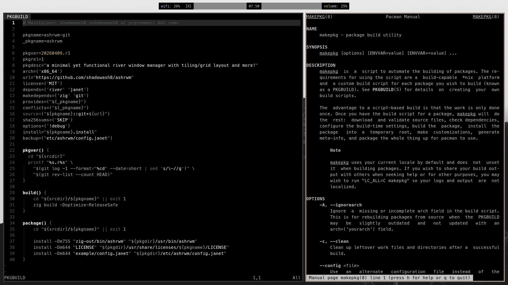

# ashrwm





A window manager for the [river](https://codeberg.org/river/river) Wayland compositor.

ashrwm is currently less than 900 lines of [Janet](https://janet-lang.org) but more than capable enough to use as my daily driver. 

## Features

- Dynamic tiling with layouts
  - Tiling layout
  - Grid layout
  - Scroller layout
  - Monocle layout
- Tags
	- Each window has exactly one tag
	- An arbitrary number of tags can be displayed at once on each output
	- Each tag can be displayed on at most one output at a time
- Floating windows
- Sticky windows
- Focus follows mouse
- libinput configuration
- Hot reload configuration
- A REPL

## Install

### AUR
```bash
paru -S ashrwm
```
OR
```bash
paru -S ashrwm-git
```


### Building

Run `zig build`. All dependencies will be fetched by Zig and built from source.

Requires Zig 0.16, a statically linked Zig binary can be obtained from https://ziglang.org/download/.

## Usage

Run ashrwm inside [river](https://codeberg.org/river/river). Requires river's
main branch (version 0.4.2). It may be useful to start ashrwm from river's
init script in `~/.config/river/init`.

example river init file:
```bash
#!/bin/sh
# Essentials
dbus-update-activation-environment --systemd WAYLAND_DISPLAY XDG_CURRENT_DESKTOP=ashrwm
/usr/lib/polkit-gnome/polkit-gnome-authentication-agent-1 &

# Startup programs
emacs --daemon &
swayidle -w timeout 600 "systemctl suspend" before-sleep "swaylock" &

ashrwm > ~/.ashrwm.log 2>&1
```

On startup ashrwm will evaluate `~/.config/ashrwm/config.janet` will be
tried, if it does not exist or has a error then it falls back to system 
default in `/etc/ashrwm/config.janet`

Get the default config by, if you have not done it already.
```bash
cp /etc/ashrwm/config.janet ~/.config/ashrwm/config.janet
```

Passing a file to ashrwm as an argument will evaluate that file instead.

See [example/config.janet](example/config.janet).

## credits
ashrwm is a fork of [rijan](https://codeberg.org/ifreund/rijan) made by the developer of river [Isaac Freund](https://codeberg.org/ifreund)
