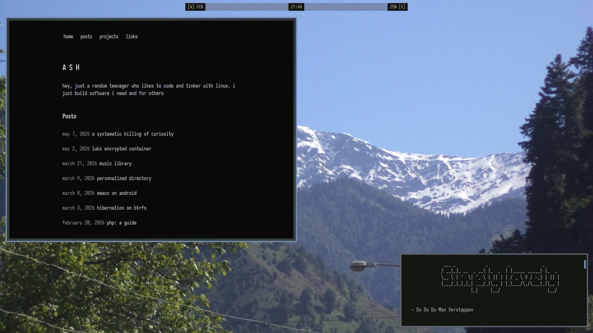
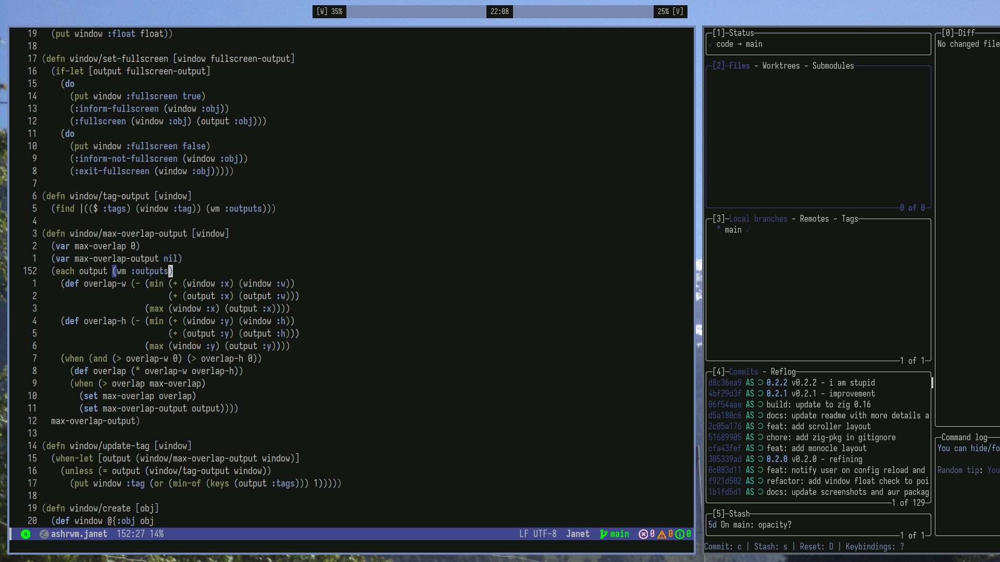
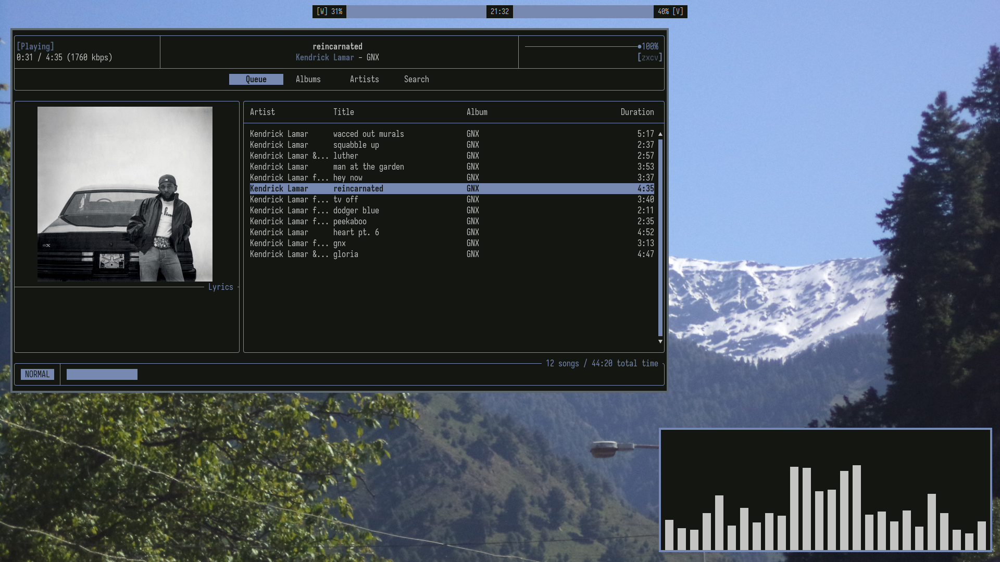
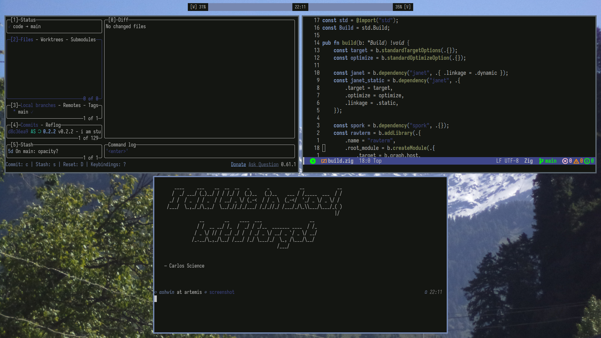

* ashrwm

A window manager for the [[https://codeberg.org/river/river][river]] Wayland compositor.

ashrwm is currently around 900 lines of [[https://janet-lang.org][Janet]] but
capable enough to use as my daily driver. 

** features

- Dynamic tiling with layouts
  - Tiling layout
  - Grid layout
  - Scroller layout
  - Monocle layout
- Tags
	- Each window has exactly one tag
	- An arbitrary number of tags can be displayed at once on each output
	- Each tag can be displayed on at most one output at a time
- Floating windows
- Sticky windows
- Focus follows mouse
- libinput configuration
- Hot reload configuration
- A REPL

** install

*** AUR
#+BEGIN_SRC bash
paru -S ashrwm
#+END_SRC

OR

#+BEGIN_SRC bash
paru -S ashrwm-git
#+END_SRC

*** building

Run `zig build`. All dependencies will be fetched by Zig and built from source.

Requires Zig 0.16, a statically linked Zig binary can be obtained from https://ziglang.org/download/.

** usage

Run ashrwm inside [[river][https://codeberg.org/river/river]]. Requires river v0.4.5. It may be useful to start ashrwm from river's
init script in ~~/.config/river/init~.

example river init file:
#+BEGIN_SRC bash
#!/bin/sh
# essentials
dbus-update-activation-environment --systemd WAYLAND_DISPLAY XDG_CURRENT_DESKTOP=ashrwm
/usr/lib/polkit-gnome/polkit-gnome-authentication-agent-1 &

# startup programs
emacs --daemon &
swayidle -w timeout 600 "systemctl suspend" before-sleep "swaylock" &

ashrwm > ~/.ashrwm.log 2>&1
#+END_SRC

On startup ashrwm will evaluate ~~/.config/ashrwm/config.janet~ will be
tried, if it does not exist or has a error then it falls back to system 
default in ~/etc/ashrwm/config.janet~.

Get the default config by, if you have not done it already.
#+BEGIN_SRC bash
cp /etc/ashrwm/config.janet ~/.config/ashrwm/config.janet
#+END_SRC

Passing a file to ashrwm as an argument will evaluate that file instead.

See [[https://github.com/shadowash8/ashrwm/blob/main/example/config.janet][example/config.janet]].

** credits
ashrwm is a fork of [[https://codeberg.org/ifreund/rijan][rijan]] made by the developer of river [[https://codeberg.org/ifreund][Isaac Freund]].
